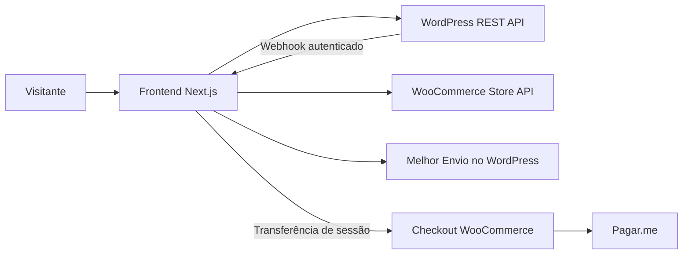

# Arquitetura e estrutura

## Responsabilidades

Next.js entrega as páginas; WordPress mantém conteúdo editorial; WooCommerce mantém catálogo, estoque, preços, sessão, pedidos e conta. O checkout nativo concentra pagamento Pagar.me e frete final. A cotação no produto consulta Melhor Envio no WordPress.

## Stack e pastas

App Router, React, TypeScript e CSS global próprio, com stylesheet local de Aprenda. Não há Tailwind como dependência neste projeto. `motion` suporta animações; `sanitize-html`, `htmlparser2` e `domutils` tratam HTML do CMS. ESLint, TypeScript, Node test runner e Playwright cobrem verificações.

| Pasta/arquivo | Papel |
| --- | --- |
| `app/` | Rotas, layouts, metadata, loading, error e not-found |
| `app/api/` | Contratos HTTP e integrações do servidor |
| `components/` | Interface compartilhada e seções específicas |
| `lib/` | Dados locais, contratos, regras e adaptadores |
| `public/assets/` | Imagens finais e contratos por superfície |
| `public/files/` | Materiais finais públicos |
| `wordpress/medicina-sagrada-headless/` | Complemento PHP |
| `scripts/` | Setup, diagnóstico, empacotamento e smoke checks |
| `tests/` | Unitários, E2E e servidor Woo simulado |
| `docs/` | Documentação técnica e operacional |
| `.impeccable/` | Direção e registros de design |
| `artifacts/` | Relatórios, ZIPs e capturas locais ignorados pelo Git |

## Renderização e cache

`app/layout.tsx` monta idioma pt-BR, fonte Adobe, link de salto, Header, CartProvider, conteúdo, Footer e JSON-LD institucional. Páginas usam Server Components para consultas; navegação, galeria, filtros, compra, sacola e Ritual Finder têm componentes interativos no cliente.

`lib/api.ts` centraliza consultas públicas com timeout padrão de 15 segundos, tags e `CONTENT_REVALIDATE_SECONDS` (fallback 900). Diversas rotas exportam também `revalidate = 900`; mudar a variável não muda esses literais. `wordpress.ts` e `woocommerce.ts` adaptam recursos externos. O catálogo solicita 12 produtos por página. Categorias são resolvidas com comparação local de slug devido é limitação documentada do filtro remoto. Variações são consultadas individualmente, com falhas parciais tratadas por `Promise.allSettled` e limite de 60 referências.

## Fluxo de compra

1. Produto e variação vêm do WooCommerce.
2. `/api/cart/` valida origem/entrada e transmite ações é Store API.
3. `lib/commerce.ts` mantém Cart-Token em `ms_cart`: HttpOnly, SameSite Lax, caminho `/`, duração de 48h e Secure quando a URL do site é HTTPS.
4. O navegador recebe os dados usados pela sacola, sem repasse intencional de token, endereços ou dados adicionais de plugins.
5. `/api/checkout/` valida disponibilidade, gateway e valores, cria sessão nova, copia itens/cupons e confere totais; retorna URL WooCommerce com `?session=` e atualiza o cookie para a sessão preparada.
6. Checkout nativo conclui endereço, frete e pagamento. GET `/checkout/` apenas encaminha é sacola para evitar início de checkout por prefetch.

Leituras privadas usam `no-store` e query aleatória contra cache indevido. Respostas com indicadores de HIT são rejeitadas. Token de sessão em URL deve ser excluído de logs e analytics.

## Módulos por assunto

Componentes abaixo são relativos a `components/`; regras/dados, a `lib/`.

| Assunto | Arquivos principais |
| --- | --- |
| Catálogo | `catalog.tsx`, `catalog-filters.tsx`, `catalog-query.ts`, `woocommerce.ts` |
| Produto | `product-intro.tsx`, `product-gallery.tsx`, `product-purchase.tsx`, `product-purchase-controls.tsx`, `product-card.tsx` |
| Sacola | `cart-provider.tsx`, `cart-drawer.tsx`, `cart-page.tsx`, `commerce.ts`, `cart-validation.ts` |
| Frete | `shipping-calculator.tsx`, `shipping.ts`, `shipping-validation.ts` |
| Avaliações | `product-reviews.tsx`, `product-review-form.tsx`, `reviews.ts`, `review-submission.ts` |
| Ritual Finder | `product-matcher.tsx`, `rituals-data.ts`, `ritual-recommendation.ts`, `ritual-product-selection.ts`, `ritual-catalog.ts` |
| Home | `app/page.tsx`, `home-content.ts`, `home-*.tsx`, `live-hero.tsx` |
| Aprenda | `app/aprenda/`, `learn-content.ts`, `learn-people-grid.tsx`, `learn-image-slot.tsx` |
| Editorial | `wordpress.ts`, `html.ts`, `article-cta.ts`, `article-content.tsx`, `category-editorial.ts` |
| Etnias | `ethnicity-colors.ts`, `ethnicity-banner-assets.ts`, `other-ethnicity-products.ts` |
| SEO | `seo.ts`, `url.ts`, `json-ld.tsx`, `app/robots.ts`, `app/sitemap.ts` |
| Diagnóstico | `diagnostics.ts`, `commerce-diagnostics.ts`, `diagnostic-request.ts` |

## Segurança e limites

HTML editorial é sanitizado; hosts de iframe ficam limitados aos definidos em `lib/html.ts`. Mutações de compra, frete e avaliação verificam origem e leem JSON até 8192 bytes. Headers e regras de imagem ficam em `next.config.ts`; a CSP restringe operações específicas, sem ser uma política completa de scripts/fontes/conexões.

Avaliações recebem credenciais do próprio cliente numa requisição ao Next, que abre sessão WordPress somente para aquele envio. Exigem WordPress HTTPS; cookies de login não voltam ao navegador. O bloqueio de tentativas é em memória por instância, não distribuído. Conta e histórico permanecem no WooCommerce. Credenciais administrativas opcionais não participam da sacola.

## Complemento WordPress

PHP local versão 1.0.1: expõe `/wp-json/ms-headless/v1/status`, marca rotas privadas contra cache, acompanha sessões/pedidos para limpeza da sacola de origem e dispara revalidação em mudanças de conteúdo, estoque e categorias. Usa `MS_HEADLESS_URL` e `MS_REVALIDATION_SECRET`; envio não bloqueante, sem fila durável. O arquivo no repo não prova instalação/ativação. Consulte [Pagamentos](PAGAMENTOS.md).
